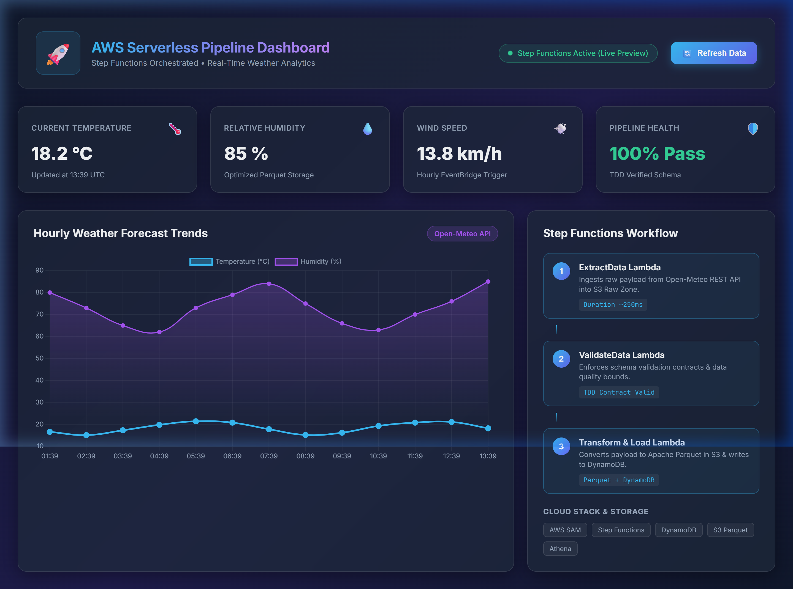
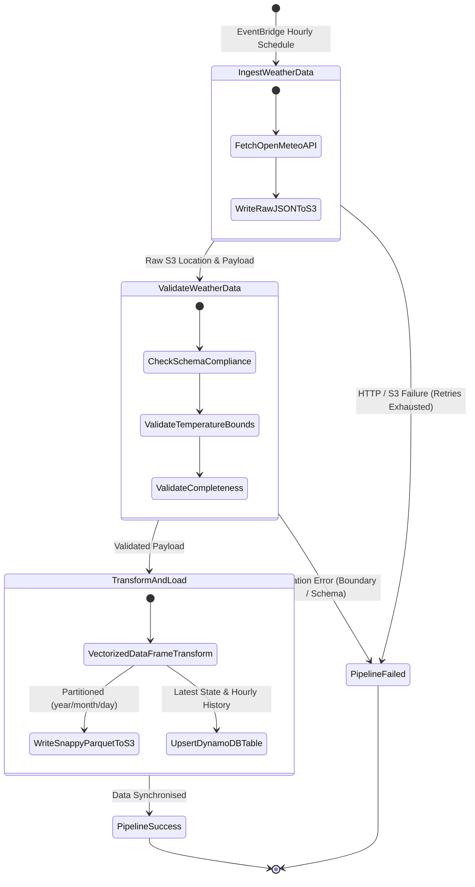

# AWS Serverless Data Engineering Pipeline & Real-Time Analytics Dashboard 🚀

[](https://github.com/praiseOjay/aws-serverless-data-pipeline/actions/workflows/ci.yml)
[](https://www.python.org/)
[](https://aws.amazon.com/serverless/sam/)
[](https://aws.amazon.com/step-functions/)
[](https://pytest.org)
[](https://github.com/psf/black)
[](https://opensource.org/licenses/MIT)

A production-grade, event-driven serverless data pipeline and real-time analytics platform built on **Amazon Web Services (AWS)** using **Test-Driven Development (TDD)** and **Infrastructure as Code (AWS SAM)**. 

The system orchestrates automated multi-stage telemetry ingestion, data validation, dual-engine storage (**OLAP Columnar Parquet in S3** + **OLTP Key-Value in DynamoDB**), ad-hoc SQL querying via **AWS Glue & Amazon Athena**, and serves real-time insights through a serverless **REST API** to an interactive, dark-mode analytics dashboard.

---

## 📑 Table of Contents

- [🏗️ System Architecture](#-system-architecture)
- [✨ Key Features & Capabilities](#-key-features--capabilities)
- [📊 Interactive Dashboard Preview](#-interactive-dashboard-preview)
- [🛠️ Tech Stack & Architecture Matrix](#-tech-stack--architecture-matrix)
- [📂 Repository Directory Structure](#-repository-directory-structure)
- [🔄 Pipeline Workflow & State Machine](#-pipeline-workflow--state-machine)
- [🌐 REST API Reference](#-rest-api-reference)
- [🔍 Amazon Athena & Glue SQL Analytics](#-amazon-athena--glue-sql-analytics)
- [🧪 Test-Driven Development (TDD) & CI/CD](#-test-driven-development-tdd--cicd)
- [🚀 Deployment Guide (AWS SAM)](#-deployment-guide-aws-sam)
- [💻 Local Development Setup](#-local-development-setup)
- [📄 License & Authors](#-license--authors)

---

## 🏗️ System Architecture

```
                               ┌───────────────────────────┐
                               │  EventBridge (Hourly CRON)│
                               └─────────────┬─────────────┘
                                             │
                                             ▼
  ╔═════════════════════════════════════════════════════════════════════════════════╗
  ║                   AWS Step Functions Orchestration Engine                       ║
  ║                                                                                 ║
  ║   ┌─────────────────────┐       ┌──────────────────────┐       ┌────────────┐   ║
  ║   │ 1. Ingester Lambda  │ ────► │ 2. Validator Lambda  │ ────► │3. Transform│   ║
  ║   │ (Fetch Open-Meteo)  │       │ (Schema/Bound Check) │       │   & Load   │   ║
  ║   └──────────┬──────────┘       └──────────────────────┘       └─────┬──────┘   ║
  ╚══════════════╪═══════════════════════════════════════════════════════╪══════════╝
                 │                                                       │
                 ▼ (Raw JSON)                                            ├────────────────────────┐
      ┌─────────────────────┐                                            ▼ (Columnar Parquet)     ▼ (Latest & History Items)
      │  S3 Raw Data Lake   │                                 ┌──────────────────────┐  ┌──────────────────────┐
      │ (Date-Partitioned)  │                                 │ S3 Processed Data    │  │   Amazon DynamoDB    │
      └─────────────────────┘                                 │ (Glue Data Catalog)  │  │  (Low-Latency OLTP)  │
                                                              └──────────┬───────────┘  └──────────┬───────────┘
                                                                         │                         │
                                                                         ▼                         ▼
                                                              ┌──────────────────────┐  ┌──────────────────────┐
                                                              │  Amazon Athena SQL   │  │  Amazon API Gateway  │
                                                              │ (Ad-hoc BI & Query)  │  │  (REST API Endpoint) │
                                                              └──────────────────────┘  └──────────┬───────────┘
                                                                                                   │
                                                                                                   ▼
                                                                                        ┌──────────────────────┐
                                                                                        │ Analytics API Lambda │
                                                                                        └──────────┬───────────┘
                                                                                                   │
                                                                                                   ▼
                                                                                        ┌──────────────────────┐
                                                                                        │  Interactive Web UI  │
                                                                                        │ (Chart.js Dashboard) │
                                                                                        └──────────────────────┘
```

---

## ✨ Key Features & Capabilities

- **State Machine Orchestration**: Coordinated via **AWS Step Functions (Amazon States Language)** with automated retry policies, exponential backoffs, and structured error catching across all pipeline execution steps.
- **Data Quality & Contract Verification**: Dedicated Python validation layer enforcing strict schema compliance, null tolerance limits, and physical telemetry sanity bounds (-50°C to +60°C).
- **Dual-Engine Storage Architecture**:
  - **OLAP Data Lake**: High-performance **Apache Parquet** format compressed with Snappy, partitioned by `year/month/day`, registered in **AWS Glue Data Catalog** for fast serverless querying via **Amazon Athena**.
  - **OLTP Real-Time Store**: Ultra-low-latency (<10ms) **Amazon DynamoDB** table storing point-in-time observations and historical query time-series records.
- **RESTful Analytics API**: **AWS API Gateway** backed by an optimised Python Lambda handler exposing high-availability endpoints with CORS support.
- **Live Glassmorphism Analytics Dashboard**:
  - Dynamic KPI metric cards with smooth numerical count-up animations and contextual telemetry subtexts.
  - Multi-timeframe visualizer (6-hour, 12-hour, 24-hour, 48-hour, and 7-day ranges).
  - Multi-metric interactive trend charts powered by **Chart.js** (Temperature, Relative Humidity, Wind Speed, Apparent Temp).
  - Client-side unit converter with seamless Celsius (°C) ⇄ Fahrenheit (°F) mathematical conversion.
  - Statistical summary telemetry strip displaying minimum, maximum, sample mean, and real-time directional trend.
  - Searchable tabular historical data grid with one-click **CSV Export**.
- **100% TDD Code Coverage**: Entire data transformation, ingestion, validation, and API routing suite backed by unit tests using `pytest` and `moto`.
- **Infrastructure as Code (IaC)**: Fully parameterised **AWS SAM** template supporting multiple environment stages (`dev`, `prod`).
- **Automated CI/CD**: Matrix-tested GitHub Actions workflow validating code across Python 3.11 and 3.12 on every push and pull request.

---

## 📊 Interactive Dashboard Preview



> **Live UI Capabilities:** Real-time refresh toggle, telemetry health monitoring, dynamic KPI trend calculations, customizable chart time windows, instant temperature unit switching, and automated CSV report generation.

---

## 🛠️ Tech Stack & Architecture Matrix

| Layer | Service / Technology | Role in Architecture |
| :--- | :--- | :--- |
| **Compute & Runtime** | AWS Lambda (Python 3.11) | Serverless microservices for Ingestion, Validation, Transformation, and API Serving |
| **Orchestration** | AWS Step Functions, EventBridge | Visual state machine execution, automated retries, and hourly cron scheduling |
| **Data Lake Storage** | Amazon S3, Apache Parquet | Raw JSON staging bucket and date-partitioned columnar processed storage |
| **Real-Time Database** | Amazon DynamoDB | Key-value store optimized for sub-10ms API read operations and time-series history |
| **Catalog & Analytics** | AWS Glue, Amazon Athena | Serverless metastore schema registration and standard SQL ad-hoc analytics |
| **API Gateway** | Amazon API Gateway | Secure HTTP REST API management with integrated CORS headers |
| **Data Engine & Layers** | Pandas, PyArrow, AWSSDKPandas | High-performance vector transformations and parquet serialization |
| **Web Frontend** | Vanilla ES6+ JS, CSS3, Chart.js | Modern glassmorphism dark-mode responsive dashboard |
| **IaC & Deployment** | AWS SAM, CloudFormation | Declarative infrastructure as code and automated deployment pipelines |
| **Testing & CI** | Pytest, Moto, GitHub Actions | 100% TDD test coverage, local AWS mocking, and multi-version CI validation |

---

## 📂 Repository Directory Structure

```
aws-serverless-data-pipeline/
├── .github/
│   └── workflows/
│       └── ci.yml                     # Multi-version Python GitHub Actions CI pipeline
├── docs/
│   └── images/
│       └── dashboard_preview.png      # Dashboard preview screenshot
├── iac/
│   ├── state_machine.asl.json         # AWS Step Functions state machine ASL definition
│   └── template.yaml                  # AWS SAM CloudFormation Infrastructure as Code
├── src/
│   ├── utils/
│   │   ├── __init__.py
│   │   └── validators.py              # Schema contract, type, and sanity boundary validators
│   ├── __init__.py
│   ├── api_handler.py                 # API Gateway REST Lambda handler (/latest, /history)
│   ├── ingester.py                    # Extraction Lambda: fetches Open-Meteo -> S3 Raw
│   ├── requirements_lambda.txt        # Runtime dependencies for AWS Lambda
│   ├── transformer.py                 # Transformation Lambda: Parquet -> S3 & DynamoDB Load
│   └── validator_lambda.py            # Step Function validation task Lambda handler
├── tests/
│   ├── conftest.py                    # Pytest fixtures and Moto AWS environment mocks
│   ├── test_api_handler.py            # Unit tests for API Gateway Lambda endpoints
│   ├── test_ingester.py               # Unit tests for API fetching and raw S3 writing
│   ├── test_transformer.py            # Unit tests for Parquet conversion & DynamoDB loads
│   ├── test_validator_lambda.py       # Unit tests for validation Lambda task
│   └── test_validators.py             # Unit tests for core schema & boundary validation logic
├── web/
│   ├── app.js                         # Dashboard frontend application logic & Chart.js engine
│   ├── index.html                     # Semantic dark-mode glassmorphism dashboard markup
│   └── styles.css                     # Premium design system, responsive styles, & animations
├── .gitignore
├── requirements-dev.txt               # Local development, testing, and linting requirements
├── requirements.txt                   # Core project dependencies
└── samconfig.toml                     # AWS SAM CLI deployment configuration
```

---

## 🔄 Pipeline Workflow & State Machine



### State Machine Error Handling & Resilience
- **Automated Retries**: Each step implements exponential backoff retry logic (`BackoffRate: 2.0`, `MaxAttempts: 3`, `IntervalSeconds: 2`) to handle transient network blips or rate limits.
- **Fail-Fast Validation**: Malformed JSON, missing critical keys, or out-of-bound sensor readings (-50°C to +60°C) immediately trip the validation guardrail, preventing corrupted records from polluting downstream analytics stores.

---

## 🌐 REST API Reference

The pipeline exposes a serverless REST API via **Amazon API Gateway** with integrated CORS headers:

### 1. Get Latest Telemetry
```http
GET /api/weather/latest HTTP/1.1
Host: <api-id>.execute-api.<region>.amazonaws.com/Prod
```

#### Response (`200 OK`):
```json
{
  "id": "latest",
  "timestamp": "2026-08-16T23:00",
  "temperature_2m": 23.3,
  "relative_humidity_2m": 59,
  "wind_speed_10m": 13.7,
  "apparent_temperature": 23.1,
  "latitude": 51.51,
  "longitude": -0.13,
  "elevation": 16.0,
  "updated_at": "2026-08-16T23:33:20.123456+00:00"
}
```

### 2. Get Historical Observations
```http
GET /api/weather/history?limit=24 HTTP/1.1
Host: <api-id>.execute-api.<region>.amazonaws.com/Prod
```

#### Response (`200 OK`):
```json
[
  {
    "id": "obs_2026-08-16T00:00",
    "timestamp": "2026-08-16T00:00",
    "temperature_2m": 20.2,
    "relative_humidity_2m": 75,
    "wind_speed_10m": 7.9,
    "apparent_temperature": 20.4
  },
  ...
]
```

---

## 🔍 Amazon Athena & Glue SQL Analytics

Because processed data is automatically stored in **Apache Parquet** format and registered with the **AWS Glue Data Catalog**, you can perform ad-hoc SQL analytics directly through **Amazon Athena**:

```sql
-- 1. Create Glue External Table (if not auto-crawled)
CREATE EXTERNAL TABLE IF NOT EXISTS weather_analytics_db_dev.weather_processed (
    timestamp STRING,
    temperature_2m DOUBLE,
    relative_humidity_2m BIGINT,
    wind_speed_10m DOUBLE,
    apparent_temperature DOUBLE,
    latitude DOUBLE,
    longitude DOUBLE,
    elevation DOUBLE
)
PARTITIONED BY (year STRING, month STRING, day STRING)
STORED AS PARQUET
LOCATION 's3://aws-data-pipeline-processed-<account>-dev/processed/'
TBLPROPERTIES ('parquet.compress'='SNAPPY');

-- 2. Repair Partitions
MSCK REPAIR TABLE weather_analytics_db_dev.weather_processed;

-- 3. Query Daily Temperature Extrema and Averages
SELECT 
    year, 
    month, 
    day,
    ROUND(AVG(temperature_2m), 2) AS avg_temp_c,
    ROUND(MIN(temperature_2m), 2) AS min_temp_c,
    ROUND(MAX(temperature_2m), 2) AS max_temp_c,
    ROUND(AVG(relative_humidity_2m), 1) AS avg_humidity_pct,
    ROUND(MAX(wind_speed_10m), 2) AS peak_wind_speed_kmh
FROM weather_analytics_db_dev.weather_processed
WHERE year = '2026' AND month = '08'
GROUP BY year, month, day
ORDER BY year DESC, month DESC, day DESC;
```

---

## 🧪 Test-Driven Development (TDD) & CI/CD

This project strictly follows **Test-Driven Development (TDD)** principles. All features and data processing routines are developed against unit test suites before implementation.

### Test Coverage Breakdown
- `test_ingester.py`: Verifies Open-Meteo REST API requests, S3 bucket partitioning, error handling, and JSON serialisation.
- `test_validator_lambda.py` & `test_validators.py`: Verifies JSON schema structure, field type validation, null handling, and physics boundary rules.
- `test_transformer.py`: Verifies Pandas/PyArrow Parquet file generation, date-partitioned S3 storage, and DynamoDB batch records loading.
- `test_api_handler.py`: Verifies API Gateway event parsing, `/latest` and `/history` DynamoDB lookups, error codes, and CORS headers.

### Running Tests Locally
```bash
# Run pytest with code coverage report
pytest --cov=src tests/ -v
```

### GitHub Actions CI Workflow
The CI pipeline (`.github/workflows/ci.yml`) automatically executes on every pull request and push to `main` and `dev`:
- Sets up Python matrix environments (`3.11`, `3.12`)
- Installs dependencies from `requirements-dev.txt`
- Runs full `pytest` suite and asserts 100% coverage

---

## 🚀 Deployment Guide (AWS SAM)

### 1. Prerequisites
- [AWS CLI v2](https://docs.aws.amazon.com/cli/latest/userguide/install-cliv2.html) installed and configured with appropriate IAM credentials (`aws configure`).
- [AWS SAM CLI](https://docs.aws.amazon.com/serverless-application-model/latest/developerguide/serverless-sam-cli-install.html) installed.
- Python 3.11 installed locally.

### 2. Build & Validate Infrastructure
```bash
# Validate CloudFormation / SAM syntax
sam validate -t iac/template.yaml

# Build SAM Lambda artefacts
sam build -t iac/template.yaml
```

### 3. Deploy to AWS
```bash
# Interactive deployment (guided)
sam deploy --guided

# Direct deployment with environment parameter
sam deploy \
  --stack-name aws-serverless-data-pipeline-dev \
  --parameter-overrides Environment=dev \
  --capabilities CAPABILITY_IAM \
  --resolve-s3
```

### 4. CloudFormation Stack Outputs
Upon deployment completion, SAM outputs the provisioned resources:
- `RawS3BucketName`: S3 bucket for incoming raw JSON payloads.
- `ProcessedS3BucketName`: S3 bucket storing columnar Parquet data.
- `DynamoDBTableName`: Table storing time-series and point-in-time metrics.
- `StateMachineArn`: Step Functions State Machine ARN for manual/scheduled triggering.

---

## 💻 Local Development Setup

### 1. Clone Repository & Setup Virtual Environment
```bash
git clone https://github.com/praiseOjay/aws-serverless-data-pipeline.git
cd aws-serverless-data-pipeline

# Create and activate virtual environment
python -m venv .venv
# On Windows PowerShell:
.\.venv\Scripts\Activate.ps1
# On Linux/macOS:
source .venv/bin/activate

# Install all development dependencies
pip install -r requirements-dev.txt
```

### 2. Run Local Web Dashboard
You can serve the web dashboard locally using Python's built-in HTTP server:
```bash
python -m http.server 8000 --directory web
```
Then navigate to `http://localhost:8000` in your web browser.

---

## 📄 License & Authors

Distributed under the **MIT License**. See `LICENSE` for more information.

Developed with ❤️ by **[praiseOjay](https://github.com/praiseOjay)**.

---
*Built with modern serverless data engineering best practices on AWS.*
